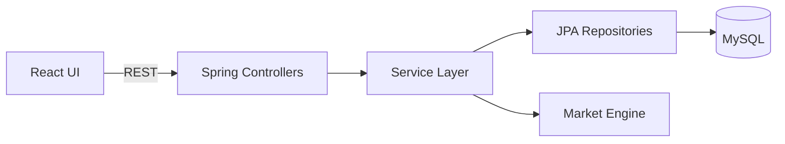
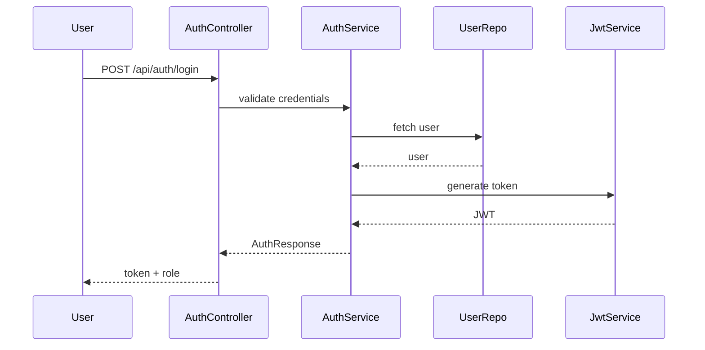
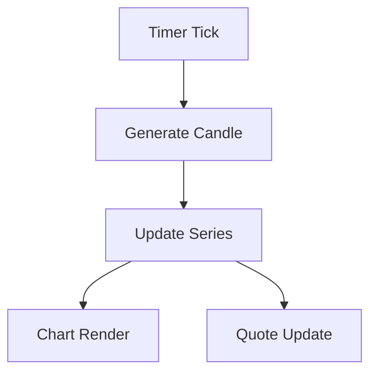
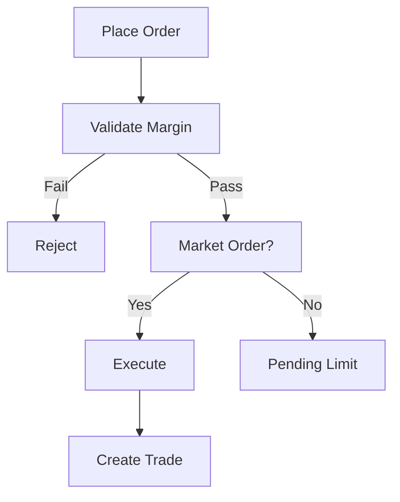
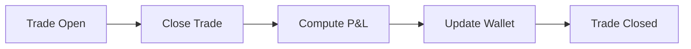
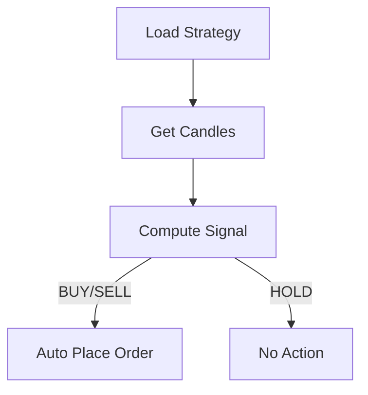
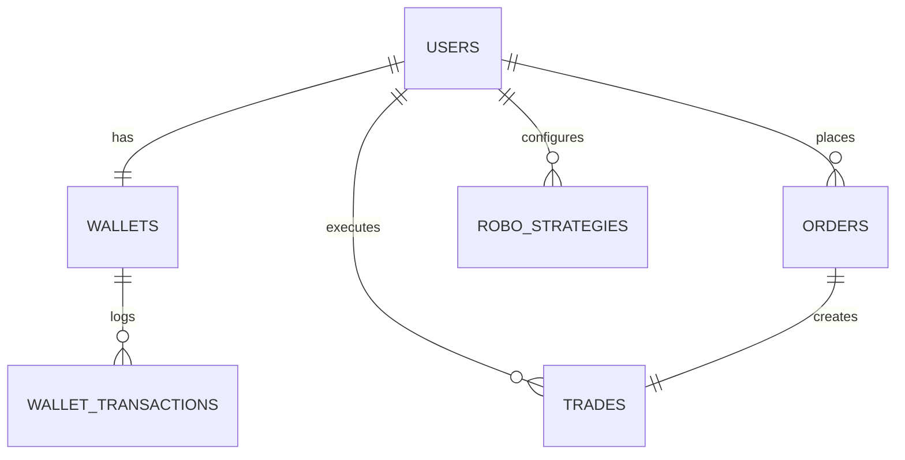

# FinNexus – Project Documentation (PG-DAC / CDAC)

## 1) Project Summary
FinNexus is a Java Full Stack forex trading simulation platform inspired by TradingView. It provides a realistic trading experience with charting, manual orders, robo strategies, wallet management, and P&L analytics. The system is modular, layered, and interview-defendable.

**Core Highlights**
- JWT-based authentication with role access
- Candlestick charts with simulated live market feed
- Manual trading (market/limit), order ledger, trade lifecycle
- Robo strategies (MA crossover, RSI)
- Wallet & fund management + transaction history
- Real-time P&L (open/closed), ROI, accuracy
- Admin dashboard (users, stats, enable/disable)

---

## 2) Technology Stack
**Backend**
- Java 17
- Spring Boot (REST)
- Spring Security + JWT
- Spring Data JPA (Hibernate)
- MySQL
- Maven
- Layered Architecture

**Frontend**
- React (Functional Components)
- React Router
- Axios
- Pure SVG candlestick chart renderer
- Responsive UI (desktop-first)

---

## 3) Folder Structure
```
/FinNexus
  /backend
    /src/main/java/com/finnexus
      /config
      /controller
      /domain
      /exception
      /repository
      /security
      /service
      /util
    /src/main/resources
  /frontend
    /src
      /api
      /components
      /context
      /pages
      /sim
      /styles
  /database
    schema.sql
    seed.sql
  /docs
    FinNexus.postman_collection.json
    PROJECT_DOCUMENTATION.md
```

---

## 4) Architecture (Layered)
**Controller → Service → Repository → DB**

- **Controller Layer**: Exposes REST endpoints
- **Service Layer**: Business rules, trading logic, calculations
- **Repository Layer**: Data access via JPA
- **Entity/DTO Layer**: Clean request/response boundaries

### Flowchart: High-Level Architecture


---

## 5) Key Modules

### 5.1 Authentication & Security
- Register/Login endpoints issue JWT tokens
- User roles: USER / ADMIN
- Protected endpoints with JWT filter

**Flowchart: Auth**


### 5.2 Market Data & Charting (SIM)
- Simulator generates candles with drift, volatility, shocks
- Works offline and for any symbol
- Frontend uses simulator if backend data fails

**Flowchart: Market Data (SIM)**


### 5.3 Manual Trading Engine
- Market & Limit orders
- Margin validation (leverage model)
- Order status: PENDING / EXECUTED / REJECTED / CANCELLED
- Executed orders create trades

**Flowchart: Order Execution**


### 5.4 Trade Lifecycle
- Trade = OPEN until closed
- Closing trade computes realized P&L

**Flowchart: Trade Lifecycle**


### 5.5 Robo Trading
- Strategy definitions per user
- Strategies can auto-trigger BUY/SELL

**Flowchart: Strategy Run**


### 5.6 Wallet & Fund Management
- Virtual balance
- Deposit / Withdraw
- Margin usage tracked

### 5.7 Analytics & P&L
- Open P&L = unrealized
- Closed P&L = realized
- ROI and accuracy

### 5.8 Admin Dashboard
- View users
- Enable/Disable
- System stats

---

## 6) Database Schema (Core Entities)
**Relationships**
- User ↔ Wallet (1:1)
- User ↔ Orders (1:N)
- User ↔ Trades (1:N)
- User ↔ Strategies (1:N)
- Wallet ↔ Transactions (1:N)

**ER Diagram**


---

## 7) API Overview (Key Endpoints)
**Auth**
- POST `/api/auth/register`
- POST `/api/auth/login`

**Market**
- GET `/api/market/candles?symbol=EURUSD&timeframe=M15&limit=60`
- GET `/api/market/quote?symbol=EURUSD`
- GET `/api/market/quotes?symbols=EURUSD,GBPUSD`

**Orders**
- POST `/api/orders`
- POST `/api/orders/{id}/cancel`
- GET `/api/orders`
- POST `/api/orders/process`

**Trades**
- GET `/api/trades`
- POST `/api/trades/{id}/close`

**Wallet**
- GET `/api/wallet`
- POST `/api/wallet/deposit`
- POST `/api/wallet/withdraw`
- GET `/api/wallet/transactions`

**Strategies**
- POST `/api/strategies`
- PUT `/api/strategies/{id}`
- DELETE `/api/strategies/{id}`
- GET `/api/strategies`
- POST `/api/strategies/run`

**Admin**
- GET `/api/admin/users`
- POST `/api/admin/users/{id}/enable`
- POST `/api/admin/users/{id}/disable`
- GET `/api/admin/stats`

Postman collection: `docs/FinNexus.postman_collection.json`

---

## 8) Frontend Flow
**User Journey**
- Login/Register → Dashboard
- Open Trade page for charts and orders
- Orders page shows invested and P&L
- Wallet page shows balance and history
- Analytics page shows performance metrics

---

## 9) Setup Steps
### Backend
```
cd backend
mvn spring-boot:run
```

### Frontend
```
cd frontend
npm install
npm run dev
```

### DB
```
CREATE DATABASE finnexus;
```

Seed data is in `database/seed.sql`.

---

## 10) CDAC Viva Notes (Explainability)
- JWT authentication: stateless security for REST
- Orders: margin validation & trade creation
- P&L: open uses live quotes, closed uses exit price
- Robo strategy: configurable logic, auto executes
- Market data: simulator ensures offline demo
- DTO usage: clean API boundaries

---

## 11) Future Enhancements
- Risk management (SL/TP)
- Multi‑asset support (indices, crypto)
- Strategy backtesting
- Real market data via API key

---

## 12) Credits
Built for PG-DAC / CDAC academic requirements.
